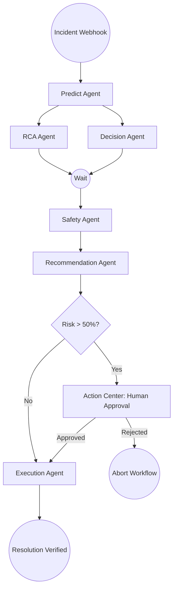
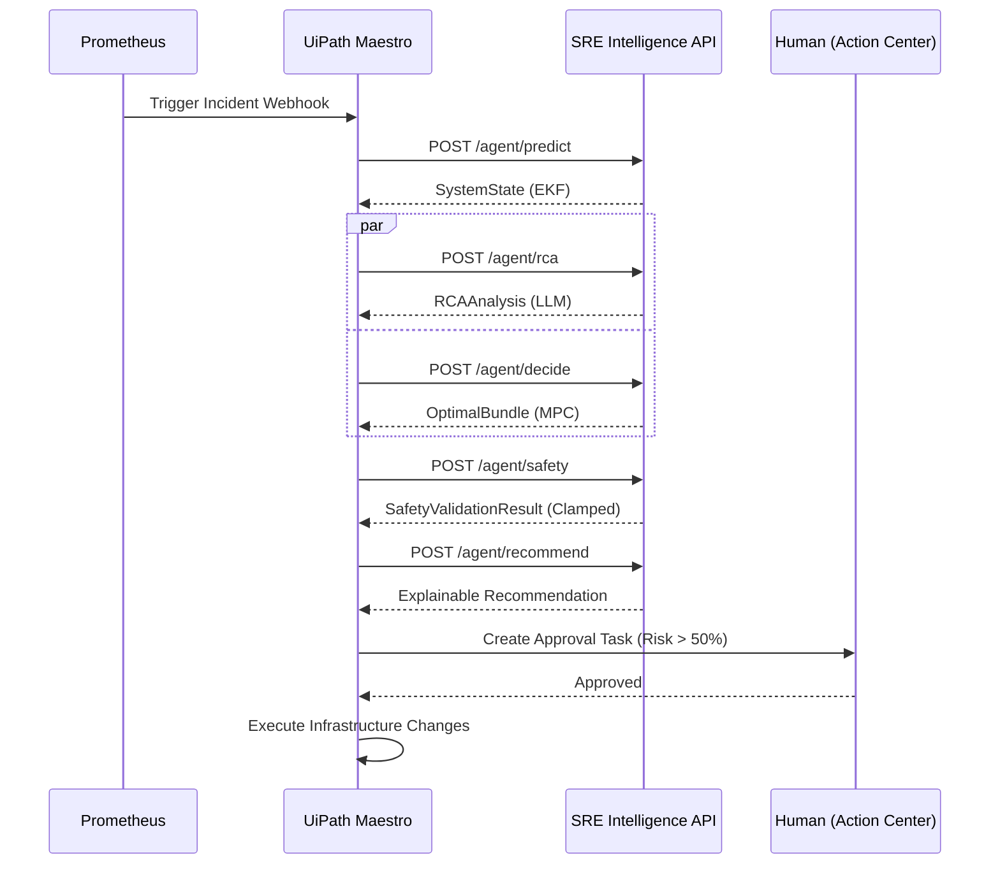

# Autonomous Incident Response Agent Architecture

**Product:** Autonomous Incident Response Agent
**Category:** Enterprise Agentic SRE Platform
**Orchestration:** Multi-Agent via UiPath Maestro

This document details the architectural migration from a monolithic PID-loop controller to a decoupled, multi-agent Intelligence Pipeline designed for UiPath Maestro integration.

---

## 1. System Overview

Traditional auto-scalers are reactive (PID loops) and standard LLM bots are purely semantic (often hallucinating remediation steps). This system merges **Hard Control Theory Mathematics** (Extended Kalman Filters, Robust Model Predictive Control) with **Semantic Explainability** (LLMs).

The system continuously reads raw telemetry, filters out noise, predicts future states, runs thousands of Monte Carlo simulations to find the safest remediation path, and ultimately packages this mathematical truth into declarative intents for UiPath Maestro to execute.

---

## 2. Agent Architecture

The intelligence monolithic `Controller` was extracted into five independent agents.

1.  **Predict Agent (`PredictionService`)**
    *   *Core Tech:* Extended Kalman Filter (EKF), System Identification (SysID)
    *   *Function:* Strips Byzantine fault noise from raw Prometheus telemetry to identify the *true* physical queue depth, capacity velocity, and Service Level Agreement (SLA) risks.
2.  **RCA Agent (`RCAService`)**
    *   *Core Tech:* LLM (DeepSeek-V3 / GitHub Models API)
    *   *Function:* Operates concurrently with decision-making. Reads the EKF state and the topology's Critical Path to output an advisory, human-readable root cause explanation.
3.  **Decision Agent (`DecisionService`)**
    *   *Core Tech:* Robust Model Predictive Control (MPC), Conditional Value at Risk (CVaR)
    *   *Function:* Generates candidate remediation bundles (Scale Replicas, Shed Load) and evaluates them via `fastRNG` Monte Carlo simulation to find the mathematically optimal action.
4.  **Safety Agent (`SafetyService`)**
    *   *Core Tech:* SLA-Aware Little's Law
    *   *Function:* The physical boundary gate. It clamps any proposed bundle to prevent slew-rate violations that would otherwise crash downstream Envoy proxies.
5.  **Recommendation Agent (`RecommendationService`)**
    *   *Core Tech:* JSON Structuring
    *   *Function:* Wraps the mathematical output into explainable semantic actions (`ScaleUp`, `ShedLoad`) for Maestro to consume easily.

---

## 3. BPMN Workflow Design

The Maestro BPMN sequence is designed for explicit state transitions, providing auditability at every step.

> [!TIP]
> Notice the split-join parallel execution of **RCA Agent** and **Decision Agent**. Because the RCA relies on a slow LLM call and the Decision Agent relies on fast CPU-bound Monte Carlo simulation, running them concurrently inside Maestro saves crucial seconds during an active incident.

---

## 4. API Contracts

### A. Predict Agent (`POST /agent/predict`)
**Input:** `{"service_id": "checkout-service"}`
**Output:** SystemState metrics (EKF output).

### B. RCA Agent (`POST /agent/rca`)
**Input:** `{"service_id": "checkout-service"}`
**Output:** RCAAnalysis (Incident Type, Suspected Root Cause, Affected Services).

### C. Decision Agent (`POST /agent/decide`)
**Input:** `{"service_id": "checkout-service"}`
**Output:** OptimalBundle (Replicas, QueueLimit, RetryLimit).

### D. Safety Agent (`POST /agent/safety`)
**Input:** `{"service_id": "checkout-service", "bundle": {...}}`
**Output:** SafetyValidationResult (IsSafe, Violations, Clamped Bundle).

### E. Recommendation Agent (`POST /agent/recommend`)
**Input:** `{"service_id": "checkout-service", "validation": {...}}`
**Output:** Recommendation (Action Intent, Confidence, Predicted Outage Probability).

---

## 5. Human Approval Flow

If `Risk > 50.0`, Maestro suspends execution and generates an Action Center Task.

**Action Center Rendering:**
*   **RCA Output:** "Payment gateway latency is causing upstream queue saturation."
*   **Action Intent:** `ShedLoad`
*   **Safety Verification Checkbox:** ✅ mathematically verified against SLA physics ceiling.
*   **Reasoning:** Details the specific slew rate clamps applied to prevent further cascading failures.

---

## 6. Sequence Diagram

---

## 7. Demo Walkthrough

For the UiPath AgentHack demonstration:
1.  **Inject Failure:** Trigger chaotic downstream latency.
2.  **Alert Fires:** Prometheus fires the webhook to UiPath Maestro.
3.  **Maestro Studio:** Show the Workflow executing in real-time. Nodes light up: `Predict` -> `Decide` -> `Safety`.
4.  **RCA Magic:** Highlight the concurrent execution of the LLM RCA node pulling the exact topology bottleneck.
5.  **Human Approval Pause:** Show the workflow halting at the Action Center node. 
6.  **Review the Output:** Open Action Center. Emphasize that the LLM is **advisory** and the remediation action is derived from **hard Control Theory physics** (CVaR optimization + Little's Law limits).
7.  **Execution:** Click "Approve". Show the system instantly dropping queues (`ShedLoad`) to preserve the SLA, preventing the simulated outage.
